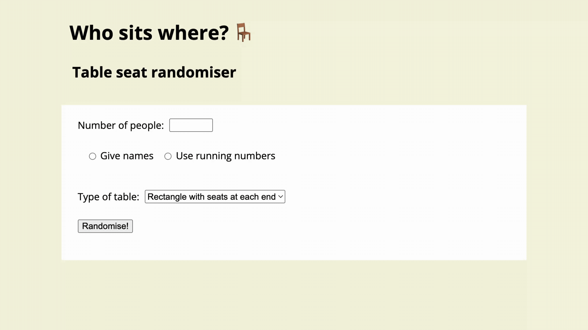

# Who sits where? 🪑 - a table seating randomiser
A simple web interface to randomise seating for a dinner table.\
This is my first practice project to learn the basics of frontend with HTML, CSS, and JavaScript.
<br><br>



### Features
- Randomised seating for 1-500 people with custom names or numbered seats
- Visual preview of seating for rectangular tables with or without seats at each end
<br><br>

### Explore the live demo 🚀
You can access the page here: https://sonjasonjao.github.io/tableseat_randomiser/ 
<br><br>

### ... or run locally
1. Clone the repository with
```bash
git clone https://github.com/sonjasonjao/tableseat_randomiser.git
```
2. Open index.html in your browser.
<br><br>

### Development Roadmap 🗺️
- Improve accessibility
- Enhance responsiveness across all devices
- Implement distinct round table layouts
- Create exportable seating charts?
<br><br>

### Inspiration 💡
I was inspired to build this page by Tuomo Ojala's original idea of a seating randomiser application.
